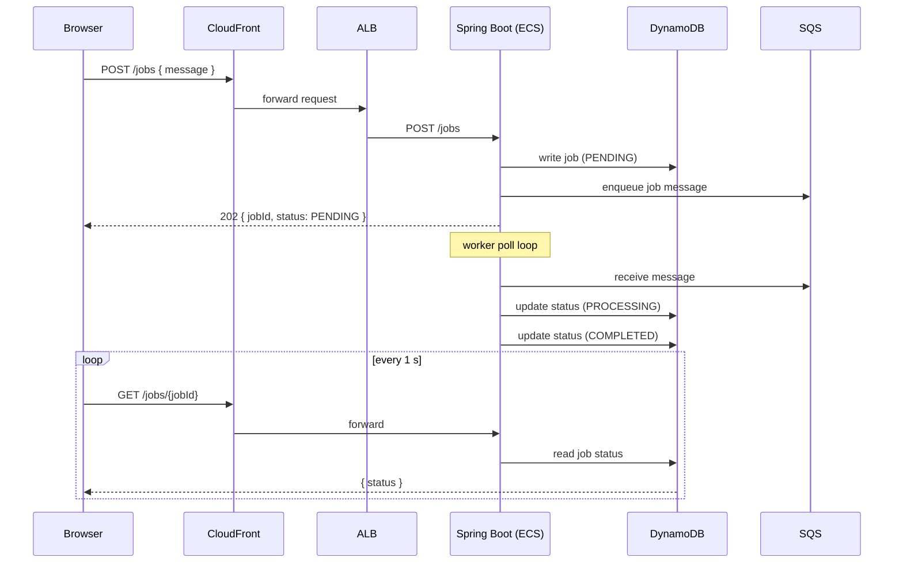

# Job Runner — React · Spring Boot · AWS Fargate

Full-stack job queue demo: a React UI submits jobs that Spring Boot writes to **DynamoDB** and enqueues on **SQS**; a worker loop transitions each job `PENDING → PROCESSING → COMPLETED`. The ECS Fargate service scales to zero when idle — a **Start Backend** button triggers a Lambda + API Gateway to spin it up (~30–60 s) — keeping the demo free between sessions. Two runtime modes let the same binary run locally without any AWS dependencies.

---

## Live Service

| Endpoint | URL |
|---|---|
| **App** | available on demand |
| **API** | available on demand |
| **Portfolio demo** | https://bganguly.github.io/#job_runner |

> ECS Fargate scales to zero when idle; click **Start Backend** to wake it (~30–60 s).

---

## Using the App

> **First visit — "Start Backend" button**
>
> The ECS Fargate service is scaled to zero when idle to avoid paying ~$7/month for an always-on container. If you land on the page and the backend is down, a **Start Backend** button appears. Click it — the UI spins up the service via Lambda + API Gateway, polls until the ALB health check passes (~30–60 s), then reloads automatically. Once the backend is running you can submit jobs normally. The service auto-stops after 10 minutes of inactivity.

1. Click **Create Job** to submit a job — the Spring Boot API writes to DynamoDB and enqueues via SQS.
2. The UI polls `GET /jobs/{jobId}` and shows the state transition: `PENDING → PROCESSING → COMPLETED`.
3. In local mode (`LOCAL_MEMORY`) jobs complete instantly in-memory; in AWS mode (`AWS_DYNAMODB_SQS`) processing runs asynchronously via the SQS consumer.

---

## Stack

| Component | Implementation |
|---|---|
| **Frontend** | React 18 + TypeScript + Vite; polls `GET /jobs/{id}` on a 1 s interval until terminal state |
| **Backend** | Spring Boot 3 on ECS Fargate (:8080); two runtime modes: `LOCAL_MEMORY` (dev) and `AWS_DYNAMODB_SQS` (prod) |
| **Job store** | DynamoDB `jobs` table keyed on `jobId`; `status` attribute drives the UI state machine |
| **Async queue** | SQS standard queue + dead-letter queue; Spring Boot worker polls and transitions `PROCESSING → COMPLETED` |
| **Scale-to-zero** | ECS desired count = 0 at rest; Lambda + API Gateway re-scales on demand and polls ALB health before returning |
| **Frontend hosting** | S3 static hosting behind CloudFront (HTTPS); Vite build with `VITE_API_BASE_URL` injected at deploy time |
| **Image build** | AWS CodeBuild builds and pushes the Spring Boot image to ECR from a source zip — no local Docker needed |
| **IaC** | CloudFormation — VPC, DynamoDB, SQS, ECS cluster + Fargate task, ALB, IAM, CloudWatch logs |

---

## Architecture

### Job submission flow — step by step

1. **Browser → React UI** — user clicks Create Job; the UI POSTs `{ "message": "..." }` to the CloudFront-fronted API URL.
2. **CloudFront → ALB → Spring Boot** — the request reaches the ECS Fargate task; Spring Boot writes a new job record to DynamoDB (`status: PENDING`) and enqueues a message to SQS, returning `202 { jobId, status }`.
3. **SQS worker loop** — the in-process Spring Boot worker polls the SQS queue; on receipt it updates the DynamoDB record to `PROCESSING`, executes the job, then updates to `COMPLETED`.
4. **UI polling** — the React UI calls `GET /jobs/{jobId}` on a 1 s interval; when it receives `COMPLETED`, polling stops and the final state is displayed.



### Key design decisions

| Concern | Approach |
|:--|:--|
| **Scale-to-zero** | ECS desired count = 0 at rest; Lambda reads the CloudFront domain from SSM and calls `update-service --desired-count 1`, then polls ALB target health — the browser only gets a response once the container is healthy |
| **Two runtime modes** | `LOCAL_MEMORY` wires an in-memory store + synchronous processor for local dev with no AWS deps; `AWS_DYNAMODB_SQS` is the production path — the same Spring Boot binary, toggled via env vars |
| **CloudFront in front of ALB** | Avoids browser mixed-content blocking (HTTPS frontend → HTTPS API) and keeps the public API URL stable across backend redeployments |
| **CodeBuild for image build** | Source zip uploaded to S3 triggers CodeBuild — no local Docker daemon needed; `deploy.sh` works from any machine |
| **SQS dead-letter queue** | Jobs that fail processing exceed the retry limit are moved to a DLQ for inspection without blocking the main queue |
| **DynamoDB key design** | Jobs keyed on UUID `jobId`; `status` is a plain string attribute — no secondary indexes needed for the single-item polling path |

---

## Architecture / Topology

```
Browser ──HTTPS──► CloudFront (CDN) ──► S3 (Vite dist)
                        │
                        └──HTTPS──► ALB ──► ECS Fargate: Spring Boot (:8080)
                                                │                │
                                                ▼                ▼
                                           DynamoDB         SQS Queue
                                          (jobs table)     (job msgs)
                               ▲──────── CloudFormation (IaC) ──────────▲
```

```
┌─────────────────────────────────────────────────────────────────────────┐
│                              AWS Account                                │
│                                                                         │
│   ECR                                                                   │
│   ┌──────────────────┐                                                  │
│   │  backend image   │◄── CodeBuild (build + push from S3 source zip)  │
│   └──────────────────┘                                                  │
│           │ image pull                  CloudFormation (IaC)           │
│           ▼                             manages all resources below     │
│   ┌─────────────────────────────────────────────────────────────┐       │
│   │                   VPC (public subnets)                      │       │
│   │                                                             │       │
│   │   ALB ──► ECS Fargate task                                  │       │
│   │   ┌──────────────────────────────────────────────────┐      │       │
│   │   │ Spring Boot (:8080)                              │      │       │
│   │   │ • POST /jobs  → DynamoDB write + SQS enqueue     │      │       │
│   │   │ • GET  /jobs/{id} → DynamoDB read                │      │       │
│   │   │ • worker: SQS poll → PROCESSING → COMPLETED      │      │       │
│   │   └────────────────────┬───────────────┬─────────────┘      │       │
│   └────────────────────────┼───────────────┼────────────────────┘       │
│                            │               │                             │
│                 ┌──────────▼───────┐  ┌────▼─────────┐                 │
│                 │   DynamoDB       │  │  SQS Queue   │                 │
│                 │  (jobs table)    │  │  (job msgs)  │                 │
│                 │  PENDING         │  └──────────────┘                 │
│                 │  PROCESSING      │                                    │
│                 │  COMPLETED       │                                    │
│                 └──────────────────┘                                    │
│                                                                         │
│   CloudFront + S3 (frontend)                                           │
│   ┌────────────────────────────────────────────────────┐               │
│   │ CloudFront (HTTPS) ──► S3 bucket (Vite dist)       │               │
│   └────────────────────────────────────────────────────┘               │
└─────────────────────────────────────────────────────────────────────────┘

Deploy flow
───────────
local machine
  └─ artifacts/aws/deploy.sh
       ├─ upload source zip → S3
       ├─ trigger CodeBuild → build + push image → ECR
       └─ deploy infra.yaml (CloudFormation)
            ├─ VPC / subnets / security groups
            ├─ DynamoDB table
            ├─ SQS queue + dead-letter queue
            ├─ ECS cluster + Fargate task + ALB
            └─ IAM roles + CloudWatch logs

  └─ artifacts/aws/deploy-frontend.sh
       ├─ deploy frontend-infra.yaml (CloudFormation)
       │    ├─ S3 bucket (static hosting)
       │    └─ CloudFront distribution
       ├─ build React app (VITE_API_BASE_URL → ApiHttpsUrl)
       ├─ upload dist/ → S3
       └─ invalidate CloudFront cache
```

## Screenshots

Main UI:


---

## Deployment / Running

Backend image build/push runs in AWS CodeBuild — local Docker is not required.

```bash
./artifacts/aws/deploy.sh <stack-name> <region> <account-id> <vpc-id> <subnet-a> <subnet-b>
./artifacts/aws/deploy-frontend.sh <frontend-stack-name> <region> <bucket-name> <api-url> frontend
```

`deploy.sh` uploads a source zip to S3, triggers CodeBuild to build and push the Spring Boot image to ECR, then deploys `infra.yaml` (CloudFormation: VPC, DynamoDB, SQS, ECS Fargate, ALB).
`deploy-frontend.sh` deploys `frontend-infra.yaml` (S3 + CloudFront), builds the React app with `VITE_API_BASE_URL` set to `ApiHttpsUrl`, uploads `dist/` to S3, and invalidates the CloudFront cache.

---

## API

- `POST /jobs` -> accepts `{ "message": "..." }`, returns `202` with `{ jobId, status }`
- `GET /jobs/{jobId}` -> returns current job state
- `GET /jobs/mode` -> returns backend mode (`LOCAL_MEMORY` or `AWS_DYNAMODB_SQS`)

